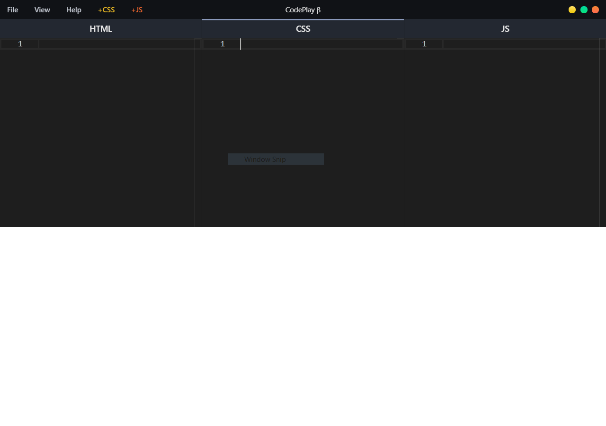

# CodePlay
An offline front-end development playground. [monaco-editor](https://microsoft.github.io/monaco-editor/) version of [Codepad](https://github.com/thecodepad/codepad) &mdash; by [Abhishek Warokar](https://github.com/apollonian11)

## Preview

## Install

```
$ git clone https://github.com/davchezt/codeplay.git
$ cd codeplay
$ yarn
$ yarn start
```